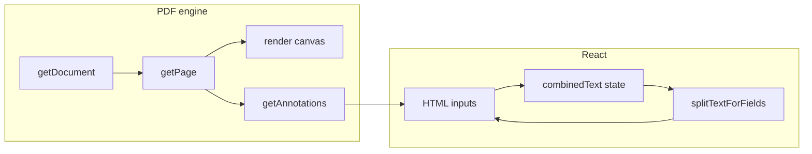

# FormFlow — Linked PDF form fields (PDF.js)

This project demonstrates a **browser-based PDF viewer** built on **Mozilla PDF.js** where several separate **AcroForm text fields** are wired together so they behave like **one continuous text area**: when the user types, text **wraps to the next field** when the current box runs out of horizontal space.

## Goals

- Render PDF pages with PDF.js (canvas).
- Read widget annotations for text fields (`getAnnotations`).
- Overlay HTML inputs aligned to each field’s rectangle in viewport space.
- Maintain a **single logical string** in application state and **split** it across fields using **canvas text measurement** (`measureText`), so overflow naturally flows to the next field.

## Tech stack

| Layer | Choice | Why |
|--------|--------|-----|
| App / UI | **React 19** + **TypeScript** | Component model, typed state, ecosystem fit for interactive editors. |
| Build | **Vite 8** | Fast dev server, native ESM, simple worker URL imports for PDF.js. |
| PDF rendering | **pdfjs-dist** | Reference PDF.js implementation; `getDocument`, `getPage`, `render`, `getAnnotations`. |
| Sample PDF | **pdf-lib** (dev-only) | Script `scripts/generate-sample.mjs` builds `public/sample.pdf` with three text fields: `addr_line1`, `addr_line2`, `addr_line3`. |

**Worker setup:** `pdfjs-dist/build/pdf.worker.mjs` is imported with Vite’s `?url` suffix and assigned to `GlobalWorkerOptions.workerSrc` so parsing runs off the main thread.

## Architecture



1. **Load** the PDF from `public/sample.pdf`.
2. **Viewport** — `page.getViewport({ scale })` defines the canvas size and coordinate system for overlays.
3. **Annotations** — Filter `subtype === 'Widget'` and `fieldType === 'Tx'` (text). Map `fieldName` → PDF `rect`, then `viewport.convertToViewportRectangle(rect)` for pixel placement.
4. **Canvas** — `page.render({ canvas, canvasContext, viewport, annotationMode: ENABLE_FORMS })` draws the page but **skips** interactive form appearances on the canvas so HTML controls are the source of truth for those widgets.
5. **Linked group** — Field order is defined in code (`LINKED_FIELD_ORDER` in `PdfFormViewer.tsx`). In production you might derive groups from PDF metadata, a sidecar JSON, or server config.
6. **Text flow** — `splitTextForFields` greedily fills each field up to its **available width** (minus padding); the remainder goes to subsequent fields; the **last** field holds any remaining text (may extend beyond visible width in a narrow box — acceptable for this demo; you could add scrolling or ellipsis in a product).

### Editing model

- **Source of truth:** one string `combinedText`.
- **On change** in field `i` with new local value `v`:  
  `mergeFieldEdit` replaces the slice that belonged to field `i` (using lengths from the **previous** split) with `v`, then the next render **re-splits** the full string. That keeps paste, delete, and multi-field edits consistent.

### Keyboard

- **Enter** or **ArrowDown** at **end of line** moves focus to the next linked field (optional UX sugar).

The viewer is **lazy-loaded** (`React.lazy`) so the initial JavaScript bundle stays smaller; PDF.js loads when the preview section mounts.

## Development flow

1. **Install** (Node 20+ recommended):
   ```bash
   npm install
   ```
2. **Regenerate the sample PDF** (optional if `public/sample.pdf` is missing or you change the script):
   ```bash
   npm run generate-sample
   ```
3. **Run the app:**
   ```bash
   npm run dev
   ```
4. **Production build:**
   ```bash
   npm run build
   npm run preview
   ```

## Extending toward production

- **Persist values** — Use `AnnotationStorage` / export pipeline (e.g. pdf-lib) to write filled values back into the PDF file.
- **More accurate metrics** — Match embedded PDF fonts (PDF.js font loading) instead of a fixed CSS font string for `measureText`.
- **Dynamic linking** — Discover field groups from XFDF, custom PDF properties, or a CMS mapping.
- **RTL / CJK** — Current measurement is Latin-centric; extend with HarfBuzz-like shaping or PDF.js text layer if needed.

## File map

| Path | Role |
|------|------|
| `src/lib/pdf.ts` | PDF.js worker bootstrap |
| `src/lib/textFlow.ts` | Split / merge helpers |
| `src/components/PdfFormViewer.tsx` | Viewer, canvas, overlays, state |
| `scripts/generate-sample.mjs` | Creates `public/sample.pdf` |
| `public/sample.pdf` | Demo AcroForm PDF |

---

*Internal codename: FormFlow — “flow” refers to text flowing across linked fields, not CSS `float`.*
